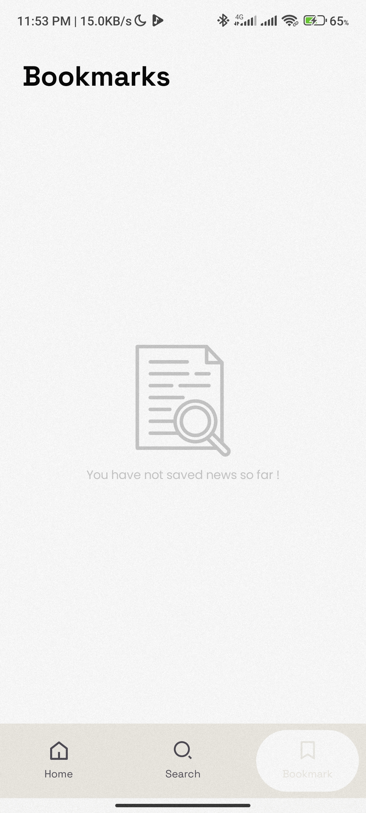

# Synth
This is an android app that fetches Games from [News API](https://newsapi.org/v2/) API. It allows one to read news from popular mainstream media such as BBC, Le Monde etc. Also allows one search for news

## Onboarding Screens

## Home Screen

#### Loading

#### Light / Dark
  

## Search Screen

#### Light / Dark
 

## Details Screen

## Bookmarks Screen

#### Light Mode / Dark Mode
 

## Model-View-ViewModel
MVVM stands for Model-View-ViewModel, an architectural pattern that effectively decouples the user interface (View) from the underlying business logic (Model). It inserts a mediator layer (ViewModel) to facilitate seamless communication between these components. This architectural approach fosters improved code structure, testability, and ease of maintaining Android applications.

## Tech Stack
- The app is entirely written in [Kotlin](https://kotlinlang.org/)
- [Hilt](https://developer.android.com/training/dependency-injection/hilt-android) - Hilt provides a standard way to use DI in your application by providing containers for every Android class in your project and managing their lifecycles automatically.
- [Jetpack Compose](https://developer.android.com/jetpack/compose) - Jetpack Compose is Android’s modern toolkit for building native UI. It simplifies and accelerates UI development on Android. Quickly bring your app to life with less code, powerful tools, and intuitive Kotlin APIs.
- [Coroutines](https://kotlinlang.org/docs/coroutines-overview.html) - A concurrency design pattern that you can use on Android to simplify code that executes asynchronously.
- [Coil Image Loader](https://skydoves.github.io/landscapist/coil/imageloader/) - a Jetpack Compose image loading library for loading async images 
- [Retrofit2](https://square.github.io/retrofit/) - A type-safe REST client for Android and Java which aims to make it easier to consume RESTful web services.
- [Kotlin Flows](https://developer.android.com/kotlin/flow) - Aids in handling streams of data asynchronously which is being executed sequentially.
- [Moshi](https://github.com/square/moshi) - a modern JSON library for Android, Java and Kotlin. It makes it easy to parse JSON into Java and Kotlin classes.
- [DataStore] - To store user preferences
- [Paging 3](https://developer.android.com/topic/libraries/architecture/paging/v3-overview) - The Paging library helps you load and display pages of data from a larger dataset from local storage or over a network.
- [Room Database](https://developer.android.com/training/data-storage/room) - To store data locally
