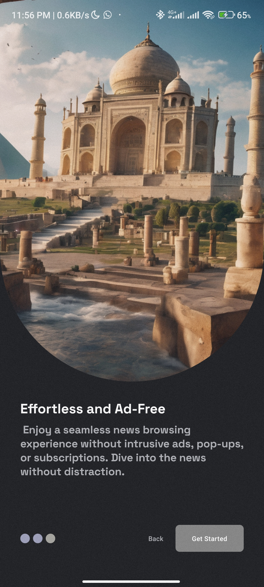
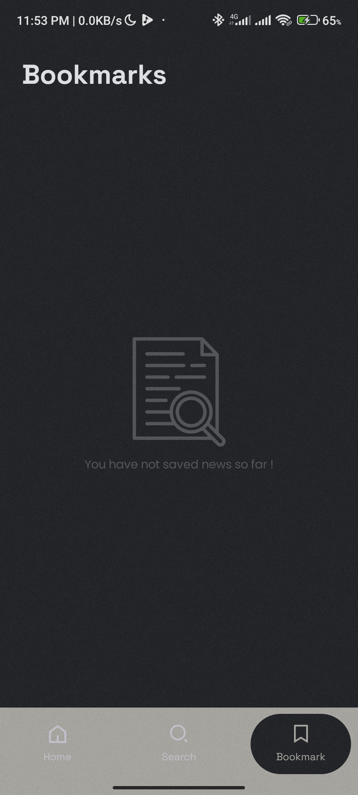

# Synth
This is an android app that fetches Games from [News API](https://newsapi.org/v2/) API. It allows one to read news from popular mainstream media such as BBC, Le Monde etc

## Onboarding Screens

## Home Screen

#### Loading

#### Light Mode

#### Dark Mode

## Search Screen

#### Light Mode

#### Dark Mode

## Details Screen

## Bookmarks Screen

#### Light Mode
 

#### Dark Mode

[//]: # ()
